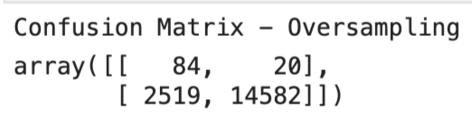
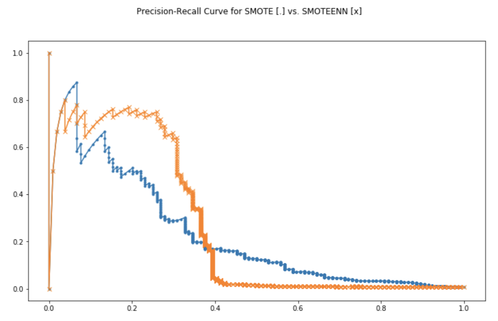
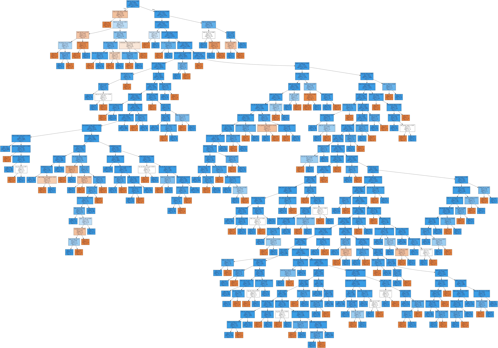
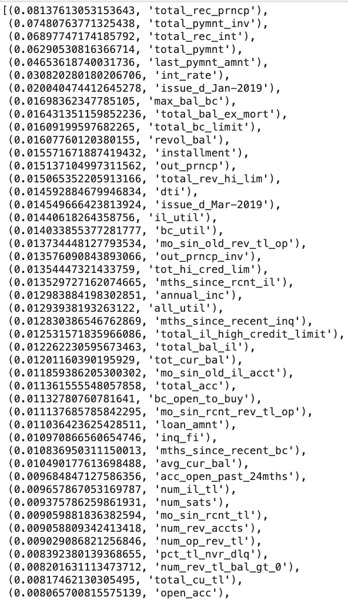

# Unit 11 — Risky Business?

## _*Now worries. Machine Learning get you covered!*_

_**In this assignment, we predict loan status by classifying data through:**_
* **Logistic regresions** 
    * interpreted as probability for its output ranges from 0 to 1
    * in this case, _**0 represents low risk and 1 stands for high risk**_
* **Process**
    * we select models based on imbalanced data structure as the percentage of good loans far outweigh the bad loans
    * training the data to fit into the model with assiciated parameters
    * interpret the [_**test statistics**_](#statistics) and compare the models to choose the best one
    * use the most robust model to predict future cases
        * before being used to make decisions, models need to be tested first

#### Test Statistics

> _**Confusion Matrix**_
> |               |   Predicted 0    | Predicted 1  |
> |---------------|------------------|------------- |
> |  Actually 0   |      TN          |     FP       |
> |  Actually 1   |      FN          |     TP       |

* **Accuracy = (TP+TN)/(TP+TN+FP+FN)** 
    * It is biased in this case as it treats FP and FN equally and out data if highly imbalanced with more weights on true negatives (TN) for loans of low risks. 
    * Therefore, other test statistics need to be considered

* **Precision = TP/(TP+FP)**
    * Out of all the "high-risk" predictions for loan statuses, how many are actually at "high risk".
    * It focuses on the "high-risk" data that there are significantly less observations and uses figuress in the second column of the confusion matrix.

* **Recall = TP/(TP+FN)**
    * How many actual "high-risk" loans are predicted correctly?
    * It features the second row of the confusion matrix that is consisted of the light-weighted data for high-risk loans
    * Recall is also the _**sensitivity**_ of the testing model

* **Specificity = TN/(TN+FP)**
    * How many of the actuall low-risk loan statuses are predicted correctly?
    * It spotlight the first row of our confusion matrix and examine only the more weighted negative observations in our data.

* **F1 = 2 x (Precision x Recall)/(Precision + Recall)**
    * F1 score is the harmonic mean of precision and recall.
    * As precission and recall usually go in opposite directions, f1 score is a good balance between the two.
    * F1 leverages the second row and column for actual and predicted "high risk" loan statuses.

### Models 
---
_**For imbalanced Data on Loan Statuses (more good than bad ones), we use the following practices and select classifiers to make logistic regression models more robust for our imbalanced observations**_

1. [Resampling](#Resampling) 
2. [Ensemble Learning](#Ensemble-Learning)
---

#### Resampling

We use the [imbalanced learn](https://imbalanced-learn.readthedocs.io) library to resample the LendingClub data.

a. Oversample the data using 

    i. the `Naive Random Oversampler` 
* The `balanced accuracy score` is 0.8301954901422769.

    ii. `SMOTE` algorithms.
* The `balanced accuracy score` is 0.8085877231650871.

b. Undersample the data using the `Cluster Centroids` algorithm.
* The `balanced accuracy score` is 0.8085877231650871.

c. Combined over- and under-sampling using `SMOTEENN` algorithm.
* The `balanced accuracy score` is 0.7897719094249999.

_**Conclusion on Resampled Classifiers**_
> **SMOTE and Naive Random sampler are our top two choices.**
> All models feature a high precision score of 0.99.
>
> The Naive Random Oversampler produces the highest balanced accuracy score of 0.83.  
>
> SMOTE Oversampler provides the best recall or sensitivity score of 0.88 by oversample from centroids of k-nearest neighborhood.
>
> The highest geometric mean score of 0.93 is created by Naive Random Sampler.
>
> SMOTE produces the best f1 score of 0.93.

### **Precision-Recall Curve**
A comparison between SMOTE oversampling and SMOTEEN combined sampling models are carried out by plotting Precision-Recall curves. The greater the area under the Precision-Recall curve, the better, or more robust the model is. As shown below, we can see that the area under the orange line marked by [x] is slightly more than that of the blue line marked with [.]. Therefore, the **SMOTEENN combined sampling is a better model**.

_**Discussion**_

**SVM**

_**SVM is not a good model for our data based on the balanced accuracy score and confusion matrix below.**_ 
* The `balanced accuracy score` is 0.5904102549108688.

**Decision Tree**

Even though recall, precision and balanced accuracy scores are all as high as 0.99, the decision tree model is not our best choice. A picture of the tree is show below. As we can see, this model is prone to **over-fitting**. 

* The `balanced accuracy score` is 0.9938390002906132.

#### Ensemble Learning

Ensembled learning combines weak and strong learners to build "hyper-models" for our imbalanced data from LendingClub. 

a. Model of `balanced random forest classifier` 
* The `balanced accuracy score` is 0.748956988570169.

**Feature importance ranking** from highest to the lowest are shown below. We can see that the top five influential features, i.e. variables, that impact the loan status to be rated as low or high risk are `total_rec_prncp`, `total_pymnt_inv`, `total_rec_int`, `total_pymnt`, `last_pymnt_amnt`.

Among featues that are most irrelevant, there are `tax_liens`, `acc_now_delinq`, `delinq_amnt`,  `pymnt_plan_n` and `recoveries`.

Note that causal effect need to be rationalized for further justification of the model.

b. Model of `easy ensemble AdaBoost classifier`.
* The `balanced accuracy score` is 0.933294499197078.

### **Conclusion on Ensemble Learning:**

> The Easy Ensemble AdaBoost Classifier has a higher balanced accuracy score of 0.93.
>
> Again, Easy Ensemble AdaBoost Classifier has a higher recall, in other words, sensitivity score of 0.94.
>
> The geometric mean score of 0.93 generated by Easy Ensemble AdaBoost Classifier is the higher of the two. 
>
> Based on Balanced Random Forest classifier, the top three features affecting loan status predictions are `total_rec_prncp`, `total_pymnt_inv` and `total_rec_int`, in that order.

### **Precision-Recall Curve**
A comparison between Balanced Random Forest and Easy Ensemble AdaBoost Classifier are carried out by plotting Precision-Recall curves. The greater the area under the Precision-Recall curve, the better, or more robust the model is. As shown below, we can see that the area under the green line marked by [x] is more than that under the purple line marked with [.]. Therefore, the **Easy Ensemble AdaBoost Classifier is a better model**.

- - -
### _Discussion_
**Gradient-Boosting Tree**
* The `balanced accuracy score` is 0.994768962510898.

A GradientBoosting Tree is shown below:

**Easy Emsemble AdaBoost Classifier is the best model** as it covers the greatest area under its green curve marked by [x]. The pink curve represents Gradient_Boosting Tree classifier model. It is marked by [^] with the least area underneath it among the three, A comparison for the precision-recall curves on the three ensemble methods are shown below. Again, the conclusion

- - -

### Files

[Resampling Notebook](Answers/Code/credit_risk_resampling.ipynb)

[Ensemble Notebook](Answers/Code/credit_risk_ensemble.ipynb)

[Lending Club Loans Data](Instructions/Resources/LoanStats_2019Q1.csv.zip)

- - -

# References:

* CU Gitlab Repository
* https://imbalanced-learn.readthedocs.io
* https://scikit-learn.org/stable/
* https://towardsdatascience.com/adaboost-for-dummies-breaking-down-the-math-and-its-equations-into-simple-terms-87f439757dcf
* https://pandas.pydata.org/pandas-docs/version/0.23.4/generated/pandas.get_dummies.html
* https://www.geeksforgeeks.org/python-pandas-series/
* https://machinelearningmastery.com/random-oversampling-and-undersampling-for-imbalanced-classification/
* https://machinelearningmastery.com/combine-oversampling-and-undersampling-for-imbalanced-classification/
* https://machinelearningmastery.com/roc-curves-and-precision-recall-curves-for-classification-in-python/
* https://towardsdatascience.com/decision-trees-and-random-forests-df0c3123f991
* https://docs.scipy.org/doc/numpy/reference/generated/numpy.ravel.html#numpy.ravel
* https://www.scikit-yb.org/en/latest/api/classifier/classification_report.html